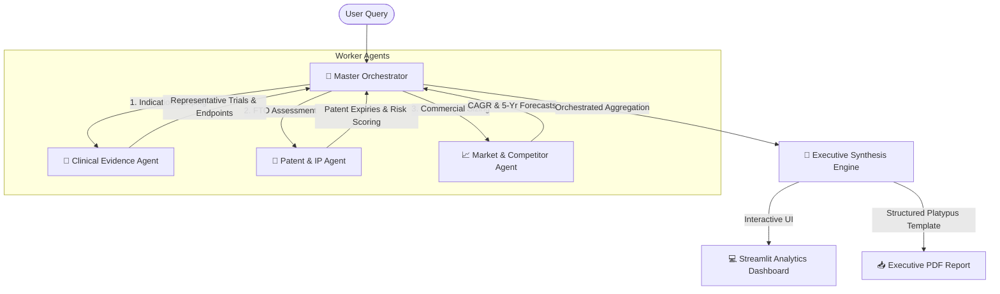

# 🧬 Agentic AI for Pharmaceutical Opportunity Discovery & Decision Support

An intelligent, multi-agent decision support system designed to accelerate early-stage pharmaceutical research, Freedom-to-Operate (FTO) assessment, and drug repurposing workflows. 

---

## 📌 Executive Summary & Business Case

Pharmaceutical companies aiming to transition from low-margin generic manufacturing to high-value proprietary pipelines must identify strategic windows of opportunity (e.g., value-added reformulations, target indications, drug repurposing). Doing so requires extensive manual research across fragmented data silos:
1. **Clinical Registries** (evaluating trial phases, endpoints, efficacy, and recruitment activity).
2. **Intellectual Property Databases** (mapping compound patents, expiries, and Freedom-to-Operate risks).
3. **Market Sizing & Commercial Signals** (estimating CAGR, sizing segments, identifying competitive density).

Traditionally, this scoping process takes a multidisciplinary team **months of manual compilation**. 

This portal showcases an **Agentic AI architecture** that automates, modularizes, and synthesizes these insights in seconds. The system coordinates specialized worker agents through a centralized **Master Orchestrator**, delivering interactive dashboards and board-ready PDF strategic briefings.

---

## 🎯 Key Capabilities & Highlights

- **Master-Worker Agentic Design:** Demonstrates a clean orchestrator pattern where a planner coordinates downstream domain experts, logs its thought process, and synthesizes clinical, patent, and market signals.
- **Dynamic NLP Simulation Engine:** Automatically parses unstructured user queries for therapeutic areas (Oncology, Metabolic, Cardiovascular, Immunology, Neurology), geographies (US, EU, JP), and compound constraints to deliver realistic, segment-specific data.
- **Orchestration Log Console:** Displays the "internal monologue" and step-by-step communication between the Orchestrator and worker agents.
- **Premium Glassmorphic Cockpit:** Designed using state-of-the-art UI/UX principles, including radial gradients, clean metrics cards, status badges, and interactive line charts showing 5-year commercial forecasts.
- **Executive-Ready PDF compiler:** Uses a robust ReportLab layout template to output formatted document briefs with callouts, styled grids, and aligned metadata.

---

## 🧱 Architecture & Data Flow

The platform employs a modular **Master-Worker Orchestration Pattern**:



1. **Master Agent (master_agent.py):** Receives the user query, schedules agent executions, captures trace logs, and compiles the final recommendation.
2. **Clinical Trials Agent (agents/clinical_agent.py):** Scopes the trial pipeline, detailing phase distribution, study status (Recruiting/Completed), and primary outcome measures.
3. **Patent & IP Agent (agents/patent_agent.py):** Reviews patent thickets (COM vs. Formulation patents), assigns risk ratings, and maps geographies.
4. **Market Agent (agents/market_agent.py):** Projects segment growth, calculates CAGRs, identifies competitors, and plots projected growth trends.
5. **PDF Generator (report/report_generator.py):** Generates styled A4 documents based on the synthesized payload.

---

## 📂 Repository Structure

```text
Pharma-agentic-ai/
│
├── agents/
│   ├── __init__.py
│   ├── clinical_agent.py    # Parsers and databases for trial data
│   ├── patent_agent.py      # FTO risk models and patent metrics
│   └── market_agent.py      # CAGR projections and commercial sizing
│
├── report/
│   └── report_generator.py  # ReportLab-based executive PDF engine
│
├── app.py                   # Streamlit dashboard and CSS styles
├── master_agent.py          # Orchestration trace and synthesis logic
├── requirements.txt         # Core dependencies
└── README.md                # System documentation
```

---

## ⚙️ Installation & Quickstart

### Prerequisites
- **Python 3.10+**
- **pip** package manager

### Setup Instructions

1. **Clone the repository:**
   ```bash
   git clone https://github.com/SSSwetha25/Pharma-agentic-ai.git
   cd Pharma-agentic-ai
   ```

2. **Install dependencies:**
   ```bash
   pip install -r requirements.txt
   ```

3. **Launch the Streamlit Portal:**
   ```bash
   streamlit run app.py
   ```

4. **Access the application:**
   Open your browser and navigate to `http://localhost:8501`.

---

## 💡 Example Evaluation Scenarios

To test the system's dynamic responsiveness, copy and paste the following queries into the input box:

1. **Oncology Focus (US-centric):**
   > *"Identify oncology small-molecule opportunities with low patent risk in the US over the next 5 years."*
   > *Result:* Matches cancer profiles, returns low patent risk in US region, and forecasts an oncology sector size of $185B+.

2. **Metabolic & Obesity (Europe-centric):**
   > *"Evaluate metabolic diabetes opportunities for novel peptide formulations in EU."*
   > *Result:* Identifies metabolic therapeutic class, targets GLP-1 style clinical trials, evaluates biologic patent thickets (high risk), and projects obesity growth at a 14.6% CAGR.

3. **Neurology Segment (Japan-centric):**
   > *"Identify neurology and Alzheimer's disease compounds with FTO in Japan."*
   > *Result:* Extracts amyloid/cognitive clinical registries, references JP patent status, and models a $48B neurology commercial curve.

---

## 🚀 Future Roadmap

To scale this prototype into a production-grade enterprise system, the following integrations are proposed:
- [ ] **Real API Connectors:** Replace simulation engines with live queries to the **ClinicalTrials.gov API**, **Google Patents API**, and **GlobalData Commercial databases**.
- [ ] **Cognitive LLM Integration:** Connect the Orchestrator to an LLM (e.g., Gemini 1.5 Pro) to read, analyze, and synthesize raw text summaries fetched from APIs.
- [ ] **Secure Authentication:** Add user log-in protocols and enterprise role-based access for strategic data sharing.
- [ ] **Multi-format Exporting:** Offer exports to Excel (for financial modeling) and PowerPoint slides (for boardroom presentations).
